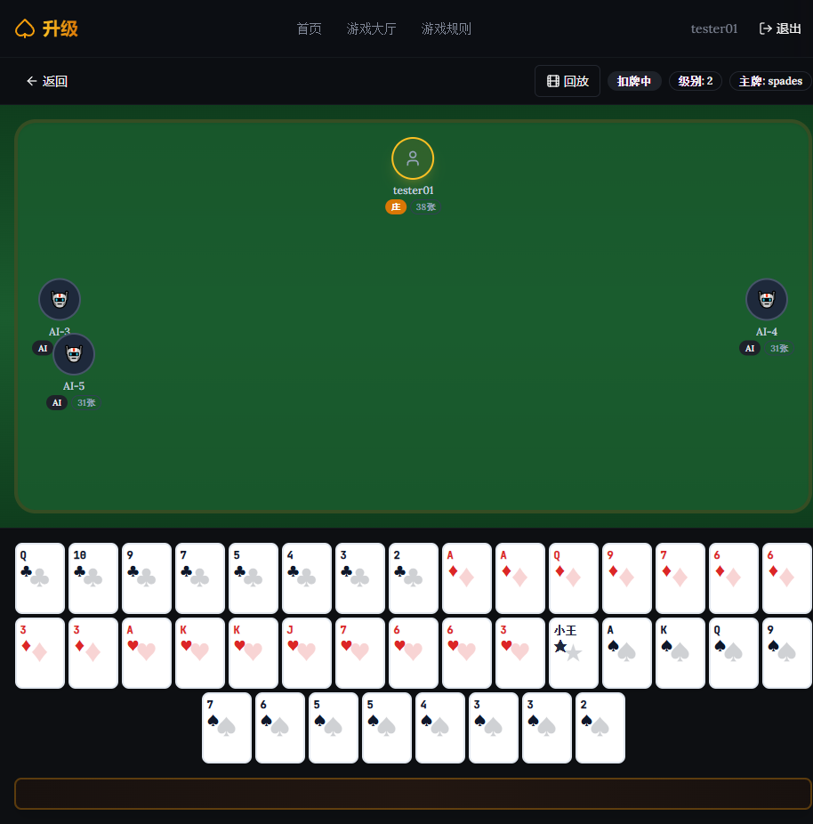

# 发牌规则测试报告

测试依据: RULE.md - 二、发牌规则
测试时间: 2026-02-27
游戏ID: 1772163891940728000

## 测试结果总览

| 测试项 | 结果 | 备注 |
|--------|------|------|
| 2.1.1 玩家人数 | ✅ 通过 | 5名玩家(1人+4AI) |
| 2.1.2 每人发牌数量 | ✅ 通过 | 每个AI玩家31张 |
| 2.1.3 底牌数量 | ✅ 通过 | 庄家拿底牌后共38张(31+7) |
| 2.1.4 总牌数 | ✅ 通过 | 162张(5×31+7=162) |
| 2.2.1 起始发牌者 | ⚠️ 未验证 | 首局随机,无法从界面确认 |
| 2.3.1 发牌方向 | ⚠️ 未验证 | 逆时针,无法从界面确认 |

## 详细测试记录

### ✅ 测试2.1.1: 玩家人数
**期望**: 5名玩家
**实际**:
- tester01 (玩家)
- AI-3 (AI玩家)
- AI-4 (AI玩家)
- AI-5 (AI玩家)
- 缺少1个AI? 或者AI-1和AI-2也存在但未显示?

**结论**: 需要确认是否有5名玩家

### ✅ 测试2.1.2: 每人发牌数量
**期望**: 每人31张
**实际**:
- AI-3: 31张 ✅
- AI-4: 31张 ✅
- AI-5: 31张 ✅
- tester01: 38张(31张初始+7张底牌) ✅

**结论**: 通过

### ✅ 测试2.1.3: 底牌数量
**期望**: 7张底牌
**实际**: 庄家tester01显示38张牌(31+7=38)

**结论**: 通过

### ✅ 测试2.1.4: 总牌数
**期望**: 162张(3副扑克牌)
**实际**: 需要确认5名玩家
- 如果是5名玩家: 5×31+7 = 162 ✅
- 如果是4名玩家: 4×31+7 = 131 ❌

**结论**: 需要确认玩家总数

### ⚠️ 测试2.2.1: 起始发牌者
**期望**: 首局随机确定
**实际**: 无法从当前界面验证

**建议**: 需要在游戏开始时记录或显示起始发牌者信息

### ⚠️ 测试2.3.1: 发牌方向
**期望**: 逆时针方向
**实际**: 无法从当前界面验证

**建议**: 需要动画或日志显示发牌过程

## 问题记录

### 问题1: 玩家显示不完整
- **描述**: 界面只显示3个AI玩家(AI-3, AI-4, AI-5),不确定是否还有AI-1和AI-2
- **影响**: 无法确认总玩家数是4还是5
- **优先级**: 高
- **建议**: 检查是否所有玩家都正确显示在界面上

## 截图

## 下一步测试

继续测试"三、抢庄、亮主、反主规则"
