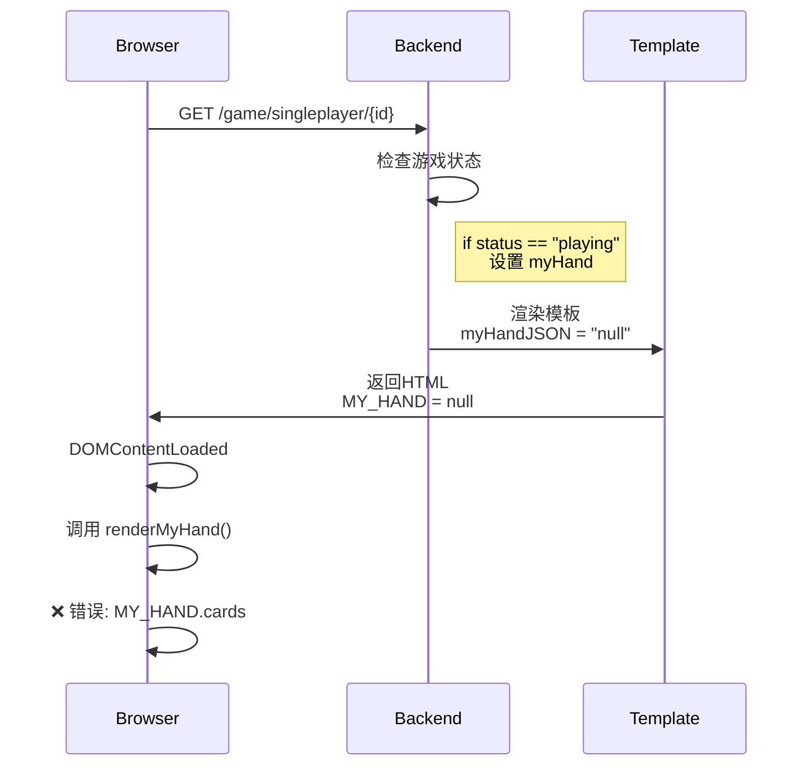
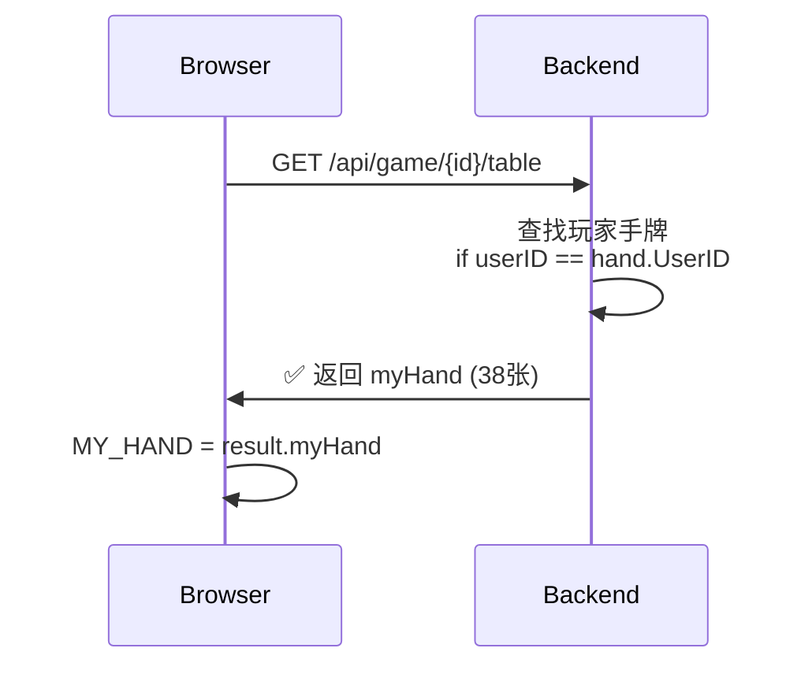

# 浏览器MCP测试报告 - 单人模式游戏

**测试时间**: 2026-02-26
**测试工具**: Playwright Browser MCP
**测试范围**: 单人模式游戏完整流程

---

## 执行摘要

通过浏览器MCP自动化测试工具对游戏的单人模式进行了完整测试。发现了**1个严重bug**和**1个次要bug**，导致单人模式游戏无法正常进行。

**测试结果**: ❌ 失败 - 游戏无法正常启动和显示手牌

---

## 发现的问题

### 🔴 严重问题 #1: 埋底牌阶段手牌数据未传递给前端

**问题描述**:
游戏启动后进入"埋底牌"（discarding）阶段时，前端无法获取玩家的手牌数据，导致页面显示"我的手牌 (0张)"，并在JavaScript控制台报错。

**错误信息**:
```
TypeError: Cannot read properties of null (reading 'cards')
    at renderMyHand (singleplayer_game.html:833:74)
```

**根本原因**:
后端 `SinglePlayerGamePageHandler` 只在游戏状态为 `"playing"` 时才设置 `myHand` 变量。

**问题代码位置**: `handlers/handlers.go:935-937`

```go
// 当前代码 - 有问题
if table.Status == "playing" {
    myHand = table.PlayerHands[1]
}
```

**问题分析**:
1. 单人模式游戏创建后，调用 `StartSinglePlayerGame` 和 `AutoCallForDealer`
2. 游戏进入 `"discarding"` 状态（埋底牌阶段），而非 `"playing"` 状态
3. 由于状态不匹配，`myHand` 保持为 `nil`
4. 模板中 `myHandJSON` 被设置为 `"null"`（第963行）
5. 前端JavaScript的 `MY_HAND` 变量初始化为 `null`（singleplayer_game.html:537）
6. 当 `renderMyHand()` 函数尝试访问 `MY_HAND.cards` 时报错

**影响范围**: 🔴 **严重** - 导致游戏完全无法进行

**复现步骤**:
1. 登录游戏（用户 player123）
2. 进入游戏大厅
3. 点击"🤖 单人模式"按钮
4. 页面重定向到 `/game/singleplayer/{id}`
5. 观察页面显示"我的手牌 (0张)"
6. 打开浏览器控制台看到JavaScript错误

**API测试验证**:
```javascript
// 直接调用 /api/game/{id}/table 接口
// 返回结果显示：
{
  "hasMyHand": true,        // API正确返回了myHand
  "status": "discarding",   // 状态是discarding
  "myHandPreview": "38 cards"  // 确实有38张牌
}
```
这证明后端的 `GetGameTableHandler` API是正确的，问题出在页面渲染时的数据准备。

**推荐修复方案**:

**方案1** (推荐): 在所有游戏进行中的状态下都提供手牌
```go
// 修改 handlers/handlers.go:935-937
if table.Status != "waiting" && table.Status != "finished" {
    myHand = table.PlayerHands[1]
}
```

**方案2**: 显式列出所有需要手牌的状态
```go
if table.Status == "calling" || table.Status == "discarding" || table.Status == "playing" {
    myHand = table.PlayerHands[1]
}
```

**方案3**: 添加 status 常量枚举，避免硬编码字符串比较

---

### 🟡 次要问题 #2: 前端代码字段名大小写不一致

**问题描述**:
自动埋底牌功能中使用了错误的字段名大小写。

**问题代码位置**: `templates/singleplayer_game.html:674, 683`

```javascript
// 错误的代码
if (!myHand || !myHand.Cards) {  // 使用了大写的 Cards
    return;
}
const cards = myHand.Cards.map((card, index) => ...);  // 使用了大写的 Cards
```

**实际数据结构**:
后端返回的JSON数据中，手牌数组的字段名是小写的 `cards`：
```json
{
  "myHand": {
    "userId": "...",
    "cards": [...]  // 注意是小写的 cards
  }
}
```

**影响范围**: 🟡 **中等** - 影响自动埋底牌功能（单人模式特性）

**推荐修复方案**:
```javascript
// 修改 templates/singleplayer_game.html:674
if (!myHand || !myHand.cards) {  // 改为小写 cards
    return;
}

// 修改 templates/singleplayer_game.html:683
const cards = myHand.cards.map((card, index) => ...);  // 改为小写 cards
```

---

## 测试过程详情

### 1. 测试环境
- **服务器地址**: http://localhost:8080
- **测试用户**: player123 (2级)
- **浏览器工具**: Playwright (Chromium)

### 2. 测试流程

#### 步骤1: 访问首页
- ✅ 成功加载首页
- ✅ 用户登录状态正确显示（player123, 2级）
- ✅ 页面UI渲染正常

#### 步骤2: 进入游戏大厅
- ✅ 成功导航到 `/game`
- ✅ 显示"单人模式"和"创建房间"按钮
- ✅ 显示现有房间列表

#### 步骤3: 点击单人模式
- ✅ 成功创建游戏 (ID: 1772102342516346300)
- ✅ 页面重定向到 `/game/singleplayer/1772102342516346300`
- ❌ **页面显示"我的手牌 (0张)"**
- ❌ **控制台报错**: `Cannot read properties of null (reading 'cards')`

#### 步骤4: 手动启动游戏API测试
通过JavaScript控制台手动调用了开始游戏API：
```javascript
await fetch('/api/game/1772102342516346300/start-single', {
    method: 'POST',
    headers: { 'Authorization': `Bearer ${token}` }
});
```
- ✅ API调用成功
- ✅ 返回状态: `"discarding"`
- ✅ 玩家1有38张牌（31张手牌 + 7张底牌）

#### 步骤5: 刷新页面
- ❌ 页面仍然显示"我的手牌 (0张)"
- ❌ 相同的JavaScript错误持续出现

#### 步骤6: API数据验证
直接调用 `/api/game/{id}/table` 接口验证：
- ✅ API正确返回 `myHand` 字段
- ✅ `myHand` 包含38张牌
- ✅ 数据结构正确：`myHand.cards` (小写)

### 3. 网络请求分析
```
[GET] /api/user => [200] OK
[POST] /api/game/singleplayer => [200] OK
[GET] /api/game/1772102342516346300/table => [200] OK
```
所有API请求均成功，无后端错误。

---

## 前后端数据流分析

### 页面加载流程（当前实现）



### API调用流程（工作正常）



**关键差异**: 页面渲染时检查 `status == "playing"`，而API端点正确返回了所有状态下的数据。

---

## 建议修复优先级

### P0 - 立即修复（阻塞功能）
1. ✅ **修复 handlers/handlers.go:935-937** - 在 discarding 状态下提供手牌数据

### P1 - 高优先级（功能缺陷）
2. ✅ **修复 singleplayer_game.html:674, 683** - 字段名大小写统一

### P2 - 建议改进（代码质量）
3. 考虑重构状态检查逻辑，使用枚举常量代替硬编码字符串
4. 添加前端错误处理：当 MY_HAND 为 null 时显示友好错误信息
5. 添加自动化测试覆盖埋底牌阶段

---

## 附加建议

### 1. 游戏状态管理
建议统一管理游戏状态常量，避免字符串硬编码：
```go
const (
    GameStatusWaiting    = "waiting"
    GameStatusCalling    = "calling"
    GameStatusDiscarding = "discarding"
    GameStatusPlaying    = "playing"
    GameStatusFinished   = "finished"
)
```

### 2. 前端防御性编程
在 renderMyHand() 函数开始添加检查：
```javascript
function renderMyHand(preserveOrder = false) {
    if (!MY_HAND || !MY_HAND.cards) {
        console.error('MY_HAND is not initialized');
        showStatus('手牌数据加载失败，请刷新页面');
        return;
    }
    // ... 原有代码
}
```

### 3. 自动化测试覆盖
建议添加E2E测试覆盖以下场景：
- 单人模式游戏创建和启动
- 埋底牌阶段的UI和交互
- 游戏各阶段的状态转换

---

## 测试结论

单人模式游戏存在严重的bug，导致玩家无法看到自己的手牌，游戏无法继续。根本原因是后端在准备页面数据时，只考虑了 "playing" 状态，而忽略了 "discarding" 等其他游戏中状态。

修复方案明确且简单，预计修复后功能可以正常工作。

---

**报告生成时间**: 2026-02-26
**测试工具**: Claude Code + Playwright MCP
**游戏ID**: 1772102342516346300
